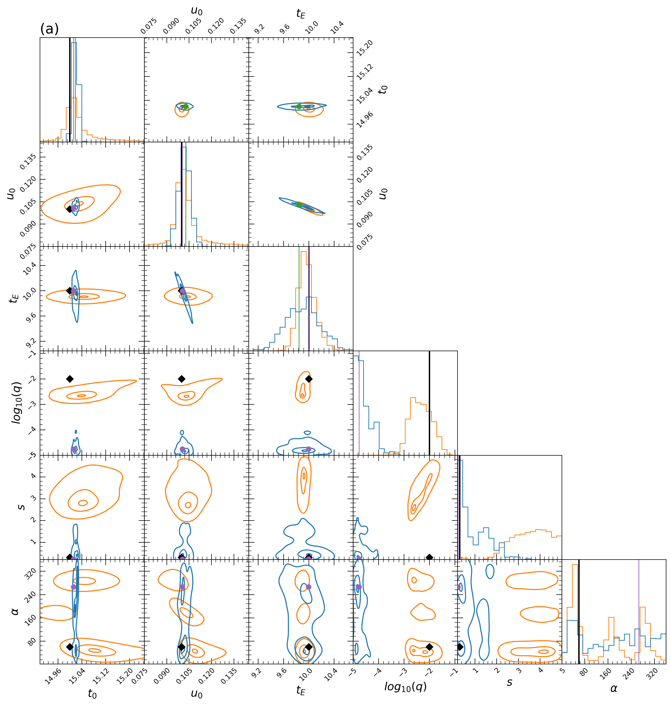

# bayesian-microlensing
Parameter estimation in gravitational microlensing typically proceeds by fitting potential lens models to observed data, even though alternate parameters and models often produce similar representations. This approach favours more complex models which are inherently more descriptive. Rather, it must be asked how probable it is that observed data is described by each lens model as a whole. Although Bayesian statistics can be used to estimate the desired marginal model probabilities from gravitational microlensing data, previously this was impractical since the gravitational microlensing joint model posterior is multi-modal and the computational expense required to sample an accurate discretisation prohibitive. Recently, it has been showen that neural networks can be used to quickly approximate the model dependant posterior distribution of gravitational microlensing data to create a surrogate posterior which encodes much of the structure of the posterior. 

This library implements an adaptive reversible-jump algorithm that efficiently refines a suite of surrogate posteriors to the true joint model posterior by utilising the topological information they provide. This enables marginal model probability estimation which can be used to remove model complexity bias when inferring gravitational microlensing events from data.

## An Example Posterior
To estimate the marginal model probabilities, the adaptive reversible-jump algorithm constructs a discrete analogue of the true posterior that is joint over all candidate models. For example, the following figure displays the single and binary lens joint model posterior for a simulated microlensing event:



The data from this figure was constructed with **example_inference.py**

## Dependencies
This library uses [MulensModel](https://rpoleski.github.io/MulensModel/install.html) to model gravitational microlensing systems.

## Usage
To construct synthetic gravitational microlensing data and initialise a single lens model:
```python
import distributions
import light_curve_simulation
import sampling

# Generate a discrete synthetic single lens event (with added noise).
parameters = [0.9, 15.0, 1.1, 32.0]
theta = sampling.State(truth=parameters)
n_obs = 720
snr = 23

data = light_curve_simulation.synthetic_single(theta, n_obs, snr)

# Create a list of single lens parameter prior distributions.
fs_pi = distributions.LogUniform(0.1, 1)
t0_pi = distributions.Uniform(0, 72)
u0_pi = distributions.Uniform(0, 2)
tE_pi = distributions.LogUniform(1, 100)

single_priors = [fs_pi, t0_pi, u0_pi, tE_pi]

# Initialise the single lens model Gaussian proposal distribution (a guess* at the true covariance of this model's posterior).
single_covariance = [[0.1, 0.0, 0.0, 0.0],
                     [0.0, 1.0, 0.0, 0.0],
                     [0.0, 0.0, 0.1, 0.0],
                     [0.0, 0.0, 0.0, 1.0]]

# Initialise the single lens model centre (a guess* at the true parameters).
single_centre = sampling.State(truth=[0.9, 15.0, 1.1, 32.0])

# Initialise the single lens model.
m = 0
D = 4
single_Model = sampling.Model(m, D, single_centre, single_priors, single_covariance, \
                                  data, light_curve_simulation.single_log_likelihood)
```

To sample from a joint single (1L1S)/binary (2L1S) model posterior:

```python
# Create pool of models.
Models = [single_Model, binary_Model]

# Sample from the joint posterior.
joint_model_chain, total_acc_history, inter_model_acc_history = \
                               sampling.ARJMH(Models, iterations, warm_up_iterations)
```
*For a use case which accurately approximates the centers and covariances with surrogate posteriors derived from neural networks, see **example_inference.py**.

## Documentation
See https://dominickeehan.github.io/bayesian-microlensing/.

## Authors and Acknowledgements
Reversible-jump algorithm and supporting code created by Dominic Keehan.

Neural networks and derived surrogate posteriors created by [Jack Yarndley](https://github.com/jackyarndley).

Bachelor of Engineering Science Honours project at the University of Auckland, supervised by [Dr Nicholas Rattenbury](https://unidirectory.auckland.ac.nz/profile/n-rattenbury).
